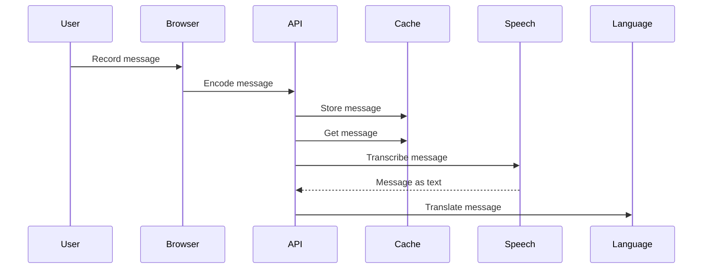

# Canto

## Purpose

To assist in the live translation between different languages.

## Design

Web based application

```mermaid

sequenceDiagram
    participant User
    participant Browser
    participant API
    participant Cache
    participant Speech
    
    User->>Browser: Record message
    Browser->>API: Encode message
    API->>Cache: Store message
    API->>Cache: Get message
    API->>Speech: Transcribe message
    Speech-->>API: Message as text
    API->>Language: Translate message
    

```